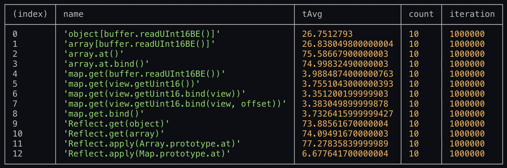

# BenchEuro
Some benchmark results for consciousness..
### ✅ USE new DataView( Buffer.buffer ).get..
### 🚫 NOT USE Buffer().read...

# Finding HotPath
## Getting a function as value from Object / Array / Map
Hotpath: read u16 value from buffer and call a function from resource which holds handler functions. Fasest method is using a map with a dataview that bound to getter function of DataView without offset (surprisingly and relaxing). 

* key -> unsigned short (Uint16)
* value -> function

```shell
node nodejs-getter-object-array-map.js
```
Code and objects used in this test:
```js
function handle_arp ( buffer ) {
    if ( buffer.readUInt16BE(0) !== CONSTANT ) {
        throw "error";
    }
} //match with

function handle_eth () {} //maybe other
function unhandle   () {} //no match

const object        = new Object;
const map           = new Map;
const array         = new Array;

object[ CONSTANT ]  = handle_arp;
array[ CONSTANT ]   = handle_arp;
map.set( CONSTANT,    handle_arp);

let 
    i, m = 1e6,    //time measure range length
    j, c = 10,     //run test times and find average
    t0,            //startedAt: time value
    t1,            //finishedAt: time value 
    tAvg           //average: sum( 10 x (t1-t0) ) / 10
;

const buffer    = Buffer.alloc( 4096 );
const view      = new DataView( buffer.buffer );

buffer.writeUInt16BE(CONSTANT, 0); //write key to buffer
```

### Winner: map.get(view.getUint16.bind(view))


***if/else - switch is NOT fastest way to find routing way (if you are using Buffer instead of ArrayBuffer .d)***

example test case:
```js
switch ( test ) {
    ...

    case "array[buffer.readUInt16BE()]":
        while (j--) {
            t0 = performance.now();
            i = m;
            while (i--) {
                array[ buffer.readUInt16BE(0) ]( buffer );
            };
            t1 = performance.now();
            r.tAvg += t1-t0;
        }
        r.tAvg /= c;
    break;

    ...
}
```