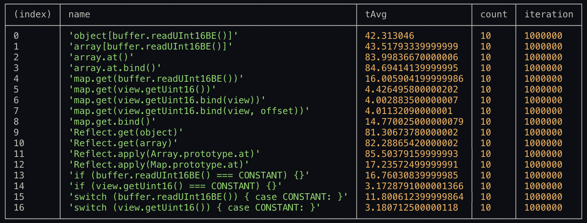

# BenchEuro
Some benchmark results for consciousness..

## Getting a function value from Object / Array / Map
Hotpath: read u16 value from buffer and call a function from resource which holds handler functions. Fasest method is using a map with a dataview that bound to getter function of DataView without offset (surprisingly and relaxing). 

* key -> unsigned short (Uint16)
* value -> function

```nodejs
node nodejs-getter-object-array-map.js
```
Code and objects used in this test:
```nodejs
function handle_arp () {}

const object = new Object;
const map = new Map;
const array = new Array;
const hascheck_set = new Set;

object[ 0x0806 ] = handle_arp;
array[ 0x0806 ] = handle_arp;
map.set( 0x0806, handle_arp );

let t0, t1, tAvg, m = 1e6, i, c = 10, j;
const buffer = Buffer.alloc( 4096 );
const view = new DataView( buffer.buffer );

buffer.writeUInt16BE(0x0806, 0);

let Map_prototype_get = Map.prototype.get;
let Array_prototype_at = Array.prototype.at;
let map_get_bind = map.get.bind(map);
let array_at_bind = array.at.bind(array);
let view_bind = view.getUint16.bind(view);
let view_bind_offset = view.getUint16.bind(view, 0);
```

### Winner: map.get(view.getUint16.bind(view))

